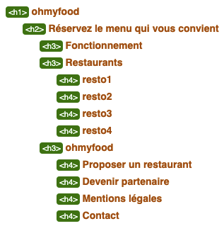
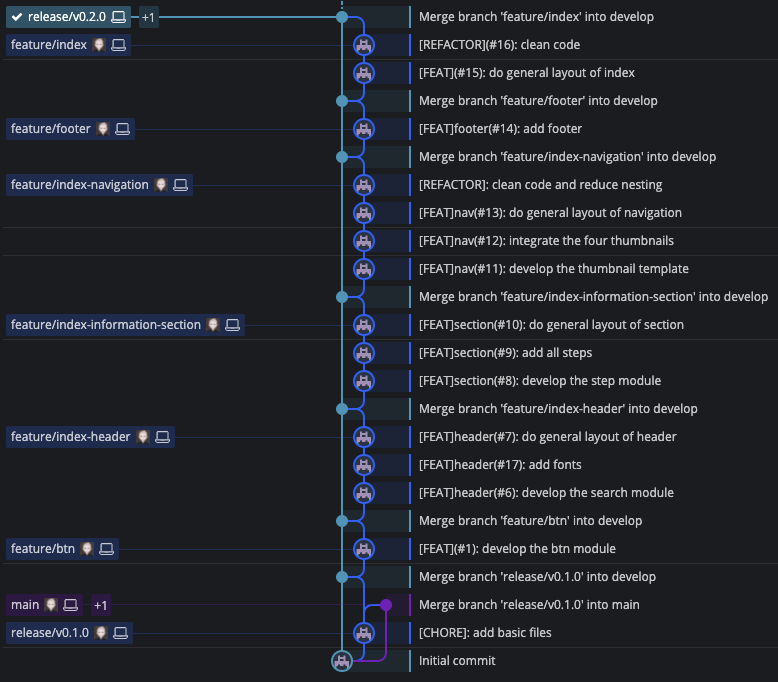
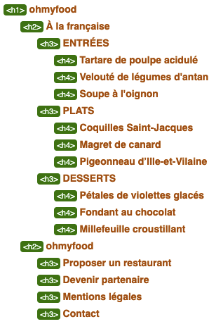
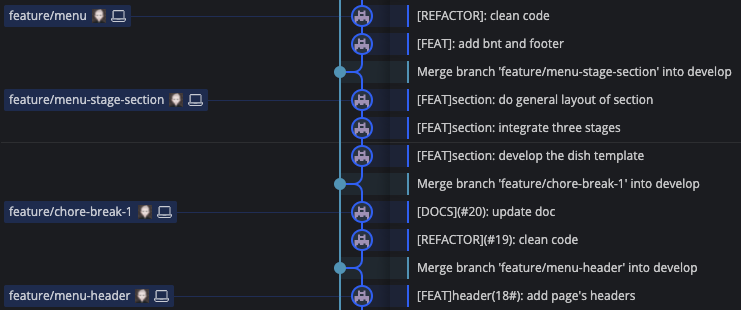

# 1. ohmyfood

- [1. ohmyfood](#1-ohmyfood)
  - [1.1. ***Index***](#11-index)
    - [1.1.1. Découpage sémantique](#111-découpage-sémantique)
    - [1.1.2. Heading-level outline](#112-heading-level-outline)
    - [1.1.3. Découpage des tâches](#113-découpage-des-tâches)
      - [1.1.3.1. Développement des éléments du site par `feature`](#1131-développement-des-éléments-du-site-par-feature)
      - [1.1.3.2. Commits réalisés par branche (GitKraken)](#1132-commits-réalisés-par-branche-gitkraken)
    - [1.1.4. SASS](#114-sass)
    - [1.1.5. `release/v0.2.0`](#115-releasev020)
  - [1.2. ***Menu***](#12-menu)
    - [1.2.1. Découpage sémantique](#121-découpage-sémantique)
    - [1.2.2. Heading-level outline](#122-heading-level-outline)
    - [1.2.3. Découpage des tâches](#123-découpage-des-tâches)
      - [1.2.3.1. Développement des éléments du site par `feature`](#1231-développement-des-éléments-du-site-par-feature)
      - [1.2.3.2. Commits réalisés par branche (GitKraken)](#1232-commits-réalisés-par-branche-gitkraken)
    - [1.2.4. SASS](#124-sass)
  - [1.3. `release/v0.3.0`](#13-releasev030)
  - [1.4. Effets `feature/effects` ***`open`***](#14-effets-featureeffects-open)
  - [1.5. `release/v0.4.0`](#15-releasev040)

## 1.1. ***Index***

### 1.1.1. Découpage sémantique

```html
<!-- Header -->
<header>
  <h1>ohmyfood</h1>
</header>
<!-- Header END -->

<main>

  <section class="introduction">

    <!-- Search-module -->
    <!-- Search-module END -->

    <h2>Réservez le menu qui vous convient</h2>
    <p>Découvrez des restaurants d'exception, sélectionnés par nos soins.</p>

    <!-- Button -->
    <!-- Button END-->

  </section>
  
  <section class="operation">
    <h2>Fonctionnement</h2>

    <!-- Step-module-N°1 -->
    <!-- Step-module-N°1 END -->

    <!-- Step-module-N°2 -->
    <!-- Step-module-N°2 END -->

    <!-- Step-module-N°3 -->
    <!-- Step-module-N°3 END -->

  </section>

  <nav class="navigation">
    <h2>Restaurants</h2>

    <!-- Restaurant-module-1 -->
    <!-- Restaurant-module-1 END -->

    <!-- Restaurant-module-2 -->
    <!-- Restaurant-module-2 END -->

    <!-- Restaurant-module-3 -->
    <!-- Restaurant-module-3 END -->

    <!-- Restaurant-module-4 -->
    <!-- Restaurant-module-4 END -->

  </nav>

</main>

<footer>
  <h2>ohmyfood</h2>
</footer>
```

### 1.1.2. Heading-level outline



### 1.1.3. Découpage des tâches

#### 1.1.3.1. Développement des éléments du site par `feature`

Chaque partie de l'accueil a été développée dans sa propre branche _Git-flow_

- `feature/btn`

- `feature/index-header`

- `feature/index-information-section`

- `feature/index-navigation`

- `feature/footer`

- `feature/index`

#### 1.1.3.2. Commits réalisés par branche (GitKraken)



### 1.1.4. SASS

La feuille de style _index.css_ a été générée par ***Sass***.  
Ci-dessous, les différents fichiers contenant le code _"scss"_ et compilés vers _"index.css"_

```scss
@charset "UTF-8";

@import
  'abstracts/variables',
  'abstracts/placeholders';

@import
  'base/base',
  'base/fonts',
  'base/typography';

@import
  'layout/header',
  'layout/footer',
  'layout/page';

@import
  'components/button';

@import
  'pages/index';
```

[Chaque fichier _"scss"_ peut être consulté dans le repertoire ***stylesheets***](#)

### 1.1.5. `release/v0.2.0`

Version non responsive de l'accueil (optimisée IPhone 8, 375px) et sans effet.

## 1.2. ***Menu***

### 1.2.1. Découpage sémantique

```html
<!-- Header -->
<header>
  <h1>ohmyfood</h1>
</header>
<!-- Header END -->

<main>

  <section class="menu">

    <!-- Menu-header -->
    <header>
      <h2>A la française</h2>
    </header>
    <!-- Menu-header END-->

    <section>
      <h3>ENTREES</h3>
    </section>

    <section>
      <h3>PLATS</h3>
    </section>

    <section>
      <h3>DESSERTS</h3>
    </section>

    <!-- Button -->
    <!-- Button END-->

  </section>

</main>

<footer>
  <h2>ohmyfood</h2>
</footer>
```

### 1.2.2. Heading-level outline



### 1.2.3. Découpage des tâches

#### 1.2.3.1. Développement des éléments du site par `feature`

Chaque partie du menu "A la française" a été développée comme l'index, dans sa propre branche _Git-flow_

- `feature/menu-header`

- `feature/menu-stage-section`

- `feature/menu`

####  1.2.3.2. Commits réalisés par branche (GitKraken)



###  1.2.4. SASS

La feuille de style _menu.css_ a été générée par ***Sass***.  
Ci-dessous, les différents fichiers contenant le code _"scss"_ et compilés vers _"menu.css"_

```scss
@charset "UTF-8";

@import
  'abstracts/variables',
  'abstracts/placeholders';

@import
  'base/base',
  'base/fonts',
  'base/typography';

@import
  'layout/header',
  'layout/footer',
  'layout/page';

@import
  'components/button';

@import
  'pages/menu';
```

[Chaque fichier _"scss"_ peut être consulté dans le repertoire ***stylesheets***](#)

## 1.3. `release/v0.3.0`

Version non responsive de _menu_3.html_ (optimisée IPhone 8, 375px) et sans effet.

## 1.4. Effets `feature/effects` ***`open`***

- \[FEAT\]: add effect on btn ***`close`***

- \[FEAT\]: add effect on heart ***`close`***

- \[FEAT\]menu: add slide effect without rotation and text-overflow ***`close`***

- \[FEAT\]menu: add effect "hide and show" ***`close`***

- \[FEAT\]menu(#22): add rotation and text-overflow to slide bloc ***`close`***

- \[FEAT\]index: add effect "loading spinner" ***`close`***

## 1.5. `release/v0.4.0`

Publication de _index.html et _menu_3.html_ avec les effets.