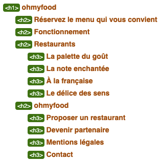

# 1. ohmyfood

Projet N°3 du parcours _Développeur Front-End_ [OpenClassrooms](https://openclassrooms.com/fr/).


L'intégration du site a été réalisée en HTML5, CSS3 et SASS sans Framework.

Le cahier des charges est consultable [ici](supply/Brief-creatif-ohmyfood.pdf) et les maquettes [ici](supply/Maquettes-Ohmyfood)

- [1. ohmyfood](#1-ohmyfood)
  - [1.1. Accueil](#11-accueil)
    - [1.1.1. Découpage sémantique](#111-découpage-sémantique)
    - [1.1.2. Heading-level outline](#112-heading-level-outline)
    - [1.1.3. Découpage des tâches](#113-découpage-des-tâches)
      - [1.1.3.1. Développement des éléments du site par `feature`](#1131-développement-des-éléments-du-site-par-feature)
      - [1.1.3.2. Commits réalisés par branche (_GitKraken)_](#1132-commits-réalisés-par-branche-gitkraken)
    - [1.1.4. SASS](#114-sass)
  - [1.2. Menu](#12-menu)
    - [1.2.1. Découpage sémantique](#121-découpage-sémantique)
    - [1.2.2. Heading-level outline](#122-heading-level-outline)
    - [1.2.3. Découpage des tâches](#123-découpage-des-tâches)
      - [1.2.3.1. Développement des éléments du site par `feature`](#1231-développement-des-éléments-du-site-par-feature)
      - [1.2.3.2. Commits réalisés par branche (GitKraken)](#1232-commits-réalisés-par-branche-gitkraken)
    - [1.2.4. SASS](#124-sass)

## 1.1. Accueil

### 1.1.1. Découpage sémantique

```html
<!-- Header -->
<header>
  <h1>ohmyfood</h1>
</header>
<!-- Header END -->

<!-- Bloc-introduction -->
<div class="introduction" role="complementary">

  <!-- Search-module -->
  Recherche de la ville et du quartier
  <!-- Search-module END -->

  <h2>Réservez le menu qui vous convient</h2>
  <p>Découvrez des restaurants d'exception, sélectionnés par nos soins.</p>

  <!-- Button -->
  <!-- Button END-->

</div>
<!-- Bloc-introduction END-->

<main>
  
  <section class="operation">
    <h2>Fonctionnement</h2>

    <!-- Step-module-N°1 -->
    <!-- Step-module-N°1 END -->

    <!-- Step-module-N°2 -->
    <!-- Step-module-N°2 END -->

    <!-- Step-module-N°3 -->
    <!-- Step-module-N°3 END -->

  </section>

  <nav class="navigation">
    <h2>Restaurants</h2>

    <!-- Restaurant-module-1 -->
    <!-- Restaurant-module-1 END -->

    <!-- Restaurant-module-2 -->
    <!-- Restaurant-module-2 END -->

    <!-- Restaurant-module-3 -->
    <!-- Restaurant-module-3 END -->

    <!-- Restaurant-module-4 -->
    <!-- Restaurant-module-4 END -->

  </nav>

</main>

<footer>
  <h2>ohmyfood</h2>
</footer>
```

### 1.1.2. Heading-level outline



### 1.1.3. Découpage des tâches

#### 1.1.3.1. Développement des éléments du site par `feature`

Chaque partie de l'accueil a été développée dans sa propre branche _Git-flow_

- `feature/btn`

- `feature/index-header`

- `feature/index-information-section`

- `feature/index-navigation`

- `feature/footer`

- `feature/index`

#### 1.1.3.2. Commits réalisés par branche (_GitKraken)_


### 1.1.4. SASS

La feuille de style **index.css** a été générée par _SASS_.  
Ci-dessous, les différents fichiers contenant le code _SCSS_ et compilés vers **index.css**

```scss
@charset "UTF-8";

@import
  'abstracts/variables',
  'abstracts/mixins',
  'abstracts/placeholders';

@import
  'base/base',
  'base/fonts',
  'base/typography';

@import
  'animations/loader',
  'animations/transition';

@import
  'layout/header',
  'layout/footer',
  'layout/page';

@import
  'components/button',
  'components/loader';

@import
  'pages/index';
```

Chaque fichier _SCSS_ peut être consulté dans le repertoire [**stylesheets**](stylesheets/)

## 1.2. Menu

### 1.2.1. Découpage sémantique

```html
<!-- Header -->
<header>
  <h1>ohmyfood</h1>
</header>
<!-- Header END -->

<main>

  <section class="menu">

    <!-- Menu-header -->
    <header>
      <h2>A la française</h2>
    </header>
    <!-- Menu-header END-->

    <section>
      <h3>ENTREES</h3>
    </section>

    <section>
      <h3>PLATS</h3>
    </section>

    <section>
      <h3>DESSERTS</h3>
    </section>

    <!-- Button -->
    <!-- Button END-->

  </section>

</main>

<footer>
  <h2>ohmyfood</h2>
</footer>
```

### 1.2.2. Heading-level outline


### 1.2.3. Découpage des tâches

#### 1.2.3.1. Développement des éléments du site par `feature`

Chaque partie des menus ont été développées comme l'**index**, dans leurs propres branches _Git-flow_

- `feature/menu-header`

- `feature/menu-stage-section`

- `feature/menu`

####  1.2.3.2. Commits réalisés par branche (GitKraken)


###  1.2.4. SASS

La feuille de style **menu.css** a été générée par _SASS_.  
Ci-dessous, les différents fichiers contenant le code _SCSS_ et compilés vers **menu.css**

```scss
@charset "UTF-8";

@import
  'abstracts/variables',
  'abstracts/mixins',
  'abstracts/placeholders';

@import
  'base/base',
  'base/fonts',
  'base/typography';

@import
  'animations/gradual-onset';

@import
  'layout/header',
  'layout/footer',
  'layout/page';

@import
  'components/button';

@import
  'pages/menu'

```

Afin d'avoir un code _CSS_ le plus léger possible et afin d'éviter les répétitions, chaque menu possède sa propre feuille de style.

Chaque fichier _SCSS_ peut être consulté dans le repertoire [**stylesheets**](stylesheets/).
